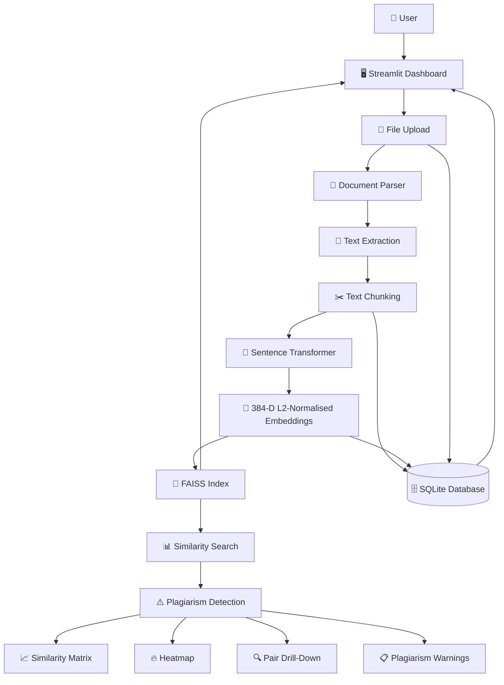
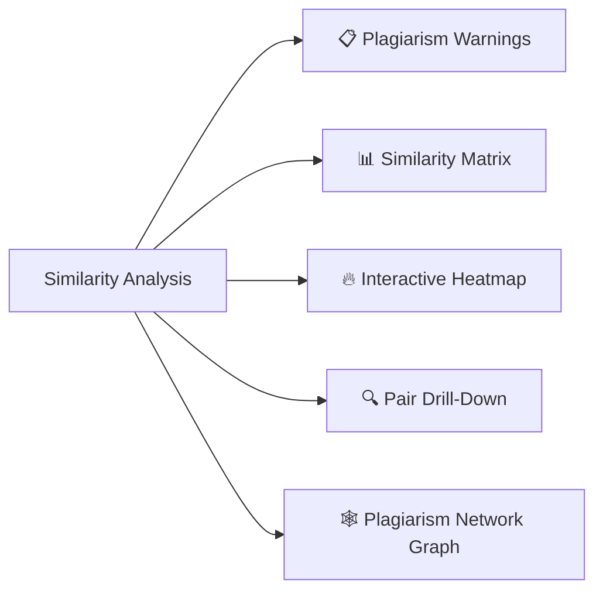
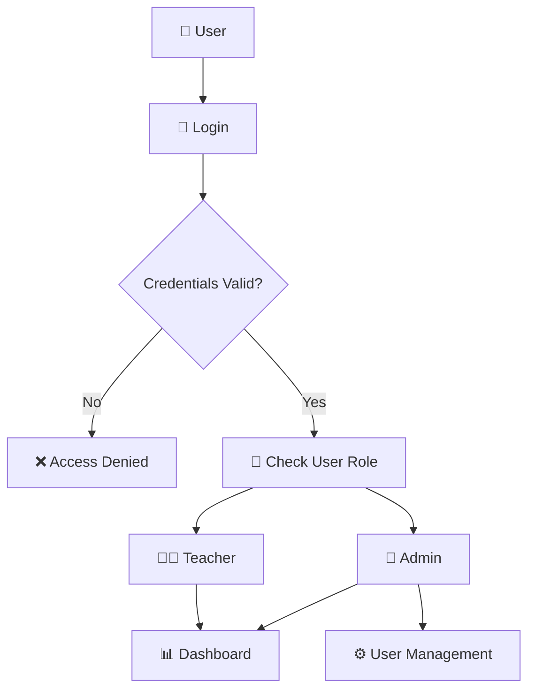

# 🏗️ System Architecture

This document explains the high-level architecture and data flow of the **Semantic Plagiarism Detection System**.

The application uses **Streamlit** as the user interface, **Sentence Transformers** for semantic embeddings, **FAISS** for efficient vector similarity search, and **SQLite** for persistent storage of users, documents, chunks, embeddings, and incidents.

---

## 🔄 Data Pipeline

The following diagram shows the primary data flow when a user uploads documents for semantic plagiarism detection.



---

## 🧩 Architecture Components

### 1. Streamlit Dashboard

**Location:** `app/streamlit_app.py`

The Streamlit application provides the main user interface.

It is responsible for:

- User authentication and role-based access
- Uploading PDF, DOCX, and TXT files
- Triggering document processing
- Running FAISS searches
- Displaying plagiarism warnings
- Rendering similarity matrices
- Displaying interactive heatmaps
- Providing pair-level plagiarism drill-down
- Managing users for administrators

---

### 2. File Upload and Document Parsing

**Location:** `src/core/document_parser.py`

Users can upload supported document formats through the Streamlit dashboard.

The document parser extracts raw text from:

- PDF files
- DOCX files
- TXT files

Scanned or image-only PDFs can optionally be processed through the OCR pipeline using PyMuPDF and Tesseract.

The extracted text is passed to the text chunking stage.

---

### 3. Text Chunking

**Location:** `src/core/text_chunking.py`

Extracted documents are divided into smaller paragraph-level chunks.

The default configuration uses:

- Minimum chunk size: **20 words**
- Maximum chunk size: **200 words**

Short sections such as headers and captions are discarded, while longer sections are split at sentence boundaries.

Chunking enables the system to identify **localised plagiarism** rather than only comparing entire documents.

---

### 4. Semantic Embeddings

**Location:** `src/core/embedding_model.py`

Each text chunk is converted into a semantic vector using:

```text
paraphrase-multilingual-MiniLM-L12-v2
```

The model generates:

- 384-dimensional embeddings
- L2-normalised vectors
- Multilingual semantic representations

Because the vectors are L2-normalised, their inner product is equivalent to cosine similarity.

This allows the system to detect plagiarism even when the original text has been significantly paraphrased.

---

### 5. FAISS Vector Search

**Location:** `src/core/faiss_index.py`

The generated embeddings are indexed using FAISS.

The system automatically selects an index based on collection size:

```text
< 5,000 vectors
        │
        ▼
IndexFlatIP
Exact similarity search

≥ 5,000 vectors
        │
        ▼
IndexIVFFlat
Approximate nearest-neighbour search
```

FAISS enables efficient chunk-level similarity searches across the document corpus.

The search results are used to identify highly similar document and paragraph pairs.

---

### 6. SQLite Database

**Locations:**

```text
src/db/auth.py
src/db/corpus_db.py
src/db/migrations/
```

SQLite provides persistent local storage for application data.

The project uses separate databases for different responsibilities:

- `users.db` — authentication and user accounts
- `corpus.db` — document metadata, text chunks, embeddings, and related corpus data

The database schema is versioned using SQLite's:

```sql
PRAGMA user_version
```

Migrations are applied automatically when the application starts, allowing existing databases to be upgraded without deleting user or corpus data.

---

### 7. Similarity Analysis

**Location:** `src/core/similarity.py`

Similarity analysis operates at two levels.

#### Document-level similarity

Mean-pooled chunk embeddings are compared to produce an N×N document similarity matrix.

#### Chunk-level similarity

FAISS searches for the nearest neighbours of each chunk and identifies the strongest matching chunks between documents.

Pairs are flagged when their similarity score meets or exceeds the configured plagiarism threshold.

Default thresholds:

| Classification | Similarity |
|---|---:|
| Plagiarism Flag | `>= 0.59` |
| Medium Severity | `>= 0.75` |
| High Severity | `>= 0.90` |

---

## 📊 Result Visualisation

After similarity analysis, results are presented through the Streamlit dashboard.



### Plagiarism Warnings

Displays flagged document pairs sorted by severity.

### Similarity Matrix

Provides a complete N×N comparison between documents.

### Heatmap

Visualises similarity scores between documents using Plotly or Seaborn.

### Pair Drill-Down

Shows the specific paragraphs that contributed to a high similarity score.

### Network Graph

Displays relationships between documents as an interactive plagiarism network.

---

## 🔐 Authentication Flow

User authentication is handled through SQLite and bcrypt password hashing.



Administrators have access to user management functionality, while teachers can use the plagiarism detection features available to their role.

---

## 🗂️ Component Overview

| Component | Location | Responsibility |
|---|---|---|
| Streamlit Dashboard | `app/streamlit_app.py` | User interface and application workflow |
| Document Parser | `src/core/document_parser.py` | Extract text from uploaded files |
| Text Chunking | `src/core/text_chunking.py` | Split documents into paragraph chunks |
| Embedding Model | `src/core/embedding_model.py` | Generate semantic embeddings |
| FAISS Index | `src/core/faiss_index.py` | Fast vector similarity search |
| Similarity Engine | `src/core/similarity.py` | Document and chunk similarity analysis |
| Auth Database | `src/db/auth.py` | User authentication and management |
| Corpus Database | `src/db/corpus_db.py` | Store document and corpus data |
| Heatmap | `src/visualization/heatmap.py` | Similarity visualisation |
| Network Graph | `src/visualization/network_graph.py` | Plagiarism relationship visualisation |

---

## 🚀 End-to-End Flow

At a high level, the complete processing pipeline is:

```text
User
  │
  ▼
Streamlit Dashboard
  │
  ▼
File Upload
  │
  ▼
Document Parsing
  │
  ▼
Text Extraction
  │
  ▼
Paragraph Chunking
  │
  ├──────────────────────┐
  ▼                      ▼
SQLite               Sentence Transformer
Metadata             Embedding Generation
Storage                   │
  │                       ▼
  │                  Vector Embeddings
  │                       │
  │                       ▼
  │                  FAISS Index
  │                       │
  └───────────┬───────────┘
              ▼
      Similarity Analysis
              │
              ▼
      Plagiarism Detection
              │
              ▼
    ┌─────────┼──────────┐
    ▼         ▼          ▼
 Warnings  Heatmaps  Pair Drill-Down
```

This architecture allows the system to combine **semantic NLP**, **vector search**, and **persistent local storage** to detect plagiarism efficiently while providing an interactive interface for academic review.

> **Note:** Redis is not currently part of the application's documented architecture. If Redis is introduced in a future version and enabled for a specific deployment or configuration, this architecture diagram should be updated to show its role in caching, session management, or background processing.Redis is an optional service and is not required for the standard local development workflow described in this repository.
